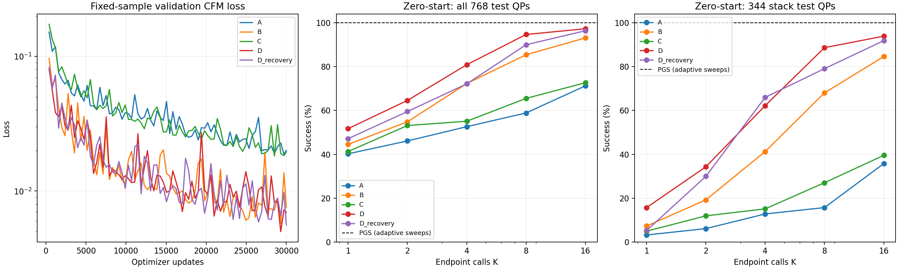

# Ablation 결과 검토 — 2026-09-15

## 결론

이번 단일 seed 실험에서 전역 통신 모델 B/D가 A/C보다 고정 QP를 잘 풀었다. D는 zero-start에서 가장 좋지만, 물리 rollout에서 B를 일관되게 앞서지 못한다. PGS와 같은 정확도를 확보한 고속 대체 solver라는 목표는 아직 달성하지 못했다.

## 입력 파일과 비교 조건

모든 모델은 seed 42, batch 512, 30,000 updates를 사용했다. 데이터·물리·정답 solver·평가 설정이 동일함을 확인했다. Train 8,448 QP/202,752쌍, val/test 각각 768 QP/18,432쌍이다. 5개 pairs_summary는 동일하며 정답 전부 수렴, 최대 projected-gradient 잔차는 약 1e-7이다. Preflight도 통과했다. 모든 고정 QP 실행과 제공된 물리 rollout은 끝까지 완료했다. 완료와 허용오차 충족은 별개다.

History에는 variant 식별자가 없다. 아래 대응은 loss 사용 여부와 best_solver 선택 update가 평가 metadata와 일치하는지 대조했다. Profile 대응은 parameter 수와 inner/recovery 호출 수로 식별했다. GPU 모델명은 로그에 기록되지 않아 A6000 실행 여부는 확인할 수 없다.

| Variant | Eval 파일 | History 파일 | 선택 update | 순수 학습 시간 |
|---|---|---|---:|---:|
| A | ablation\eval_test_best_solver.json | ablation\history.json | 30,000 | 2.89분 |
| B | eval_test_best_solver (4).json | history (3).json | 25,344 | 4.75분 |
| C | eval_test_best_solver (3).json | history (2).json | 27,720 | 7.15분 |
| D | eval_test_best_solver (2).json | history (1).json | 26,532 | 12.10분 |
| D_recovery | eval_test_best_solver (1).json | history.json | 27,720 | 25.89분 |

A=국소 CFM, B=전역 CFM, C=A+inner, D=B+inner, D_recovery=D+교란 suffix 학습.

## 고정 QP: zero-start 성공률

허용오차 1e-3, test 768장면. 각 열은 독립적인 호출 예산 K로 처음부터 적분한 결과다.

| Variant | K=1 | K=2 | K=4 | K=8 | K=16 | K=4 stack만 |
|---|---:|---:|---:|---:|---:|---:|
| A | 40.23% | 46.09% | 52.60% | 58.85% | 71.22% | 12.79% |
| B | 44.53% | 54.82% | 72.27% | 85.42% | 93.10% | 41.28% |
| C | 41.28% | 53.12% | 55.08% | 65.49% | 72.66% | 15.12% |
| D | 51.69% | 64.58% | 80.86% | 94.66% | 97.27% | 62.21% |
| D_recovery | 47.14% | 59.51% | 72.14% | 89.97% | 96.35% | 65.99% |

PGS는 모든 start mode에서 768/768 성공했다. 비학습 local head는 zero-start K=1~16 모두 296/768(38.54%)다. 296개는 free-flight 168개와 floor 128개다. Stack은 344개이며 이 subset에서 개선을 별도로 확인해야 한다.

D의 zero-start K=4 수직 stack 성공은 n=3: 41/43, n=5: 30/43, n=8: 13/43, n=10: 2/43이다. K=16에도 수직 n=10은 30/43이다. 평균 오차 감소만으로 어려운 stack이 해결됐다고 볼 수 없다.

## 시작 상태와 recovery의 교환관계

| Variant | K=4 zero | K=4 over | K=4 mixed | K=4 release (zero) |
|---|---:|---:|---:|---:|
| A | 52.60% | 51.30% | 44.79% | 64/128 |
| B | 72.27% | 70.83% | 44.92% | 117/128 |
| C | 55.08% | 45.70% | 41.02% | 75/128 |
| D | 80.86% | 66.02% | 44.14% | 111/128 |
| D_recovery | 72.14% | 73.57% | 50.52% | 31/128 |

D_recovery는 D보다 zero-start 전체 성공률이 낮지만 stack 성공은 227/344 대 214/344로 높다. 전체 성공률 하락에는 release가 111/128에서 31/128로 감소한 영향이 크다. 따라서 recovery가 전반적으로 나쁘다고 요약하면 중요한 차이를 놓친다.

K=16에서는 B가 over 92.06%로 D 81.64%보다 높고, D_recovery는 mixed 82.16%로 D 69.01%보다 높다. D_recovery의 over 성공률은 K=8 74.22%에서 K=16 72.53%로 감소한다. 호출 예산을 늘릴 때 성공률이 단조 증가하지 않는다.

| K=4 교란 평가 (각 16장면) | D | D_recovery |
|---|---:|---:|
| independent: 교란 후 성공 | 6/16 | 10/16 |
| independent: 평균 gain | 0.1135 | 0.0429 |
| correlated: 교란 후 성공 | 7/16 | 8/16 |
| correlated: 평균 gain | 0.1731 | 0.0829 |

Gain은 교란 직후의 물리 위치 차이에 대한 최종 위치 차이의 비율이며 작을수록 교란 영향이 더 줄어든다. 유효 분모가 있는 시행만 평균에 포함한다. 16개 장면의 제한된 결과이고 gain 감소만으로 절대 정확도나 일반적인 수렴을 보장하지 않는다. D_recovery의 physical rollout 파일은 이번 첨부에 없다.

## 물리 rollout

A/B/C/D 모두 4개 장면 × 300프레임을 완료했다. 아래는 K=4이며 각 solver가 자신의 궤적에서 만난 QP에 대한 미수렴 프레임 수다. 따라서 고정된 동일 QP에 대한 paired 비교와 구분해야 한다.

| 장면 | A | B | C | D | PGS |
|---|---:|---:|---:|---:|---:|
| drop_floor | 0 | 0 | 0 | 0 | 0 |
| oblique_collision | 4 | 4 | 5 | 2 | 0 |
| impact_stack | 87 | 35 | 70 | 46 | 0 |
| collapse_stack | 31 | 18 | 20 | 18 | 0 |

Impact stack의 최대 기하 침투량은 PGS 0.000996, B K=4 0.009336, D K=4 0.009574다. Collapse stack은 PGS 0.000989, B 0.005099, D 0.005404다. 기록된 값은 코드의 slop을 반영한 기하 위반량이다. B/D는 A/C보다 개선되지만 PGS 정확도에 도달하지 못했다. D가 B보다 물리적으로 우수하다고 결론 내릴 수 없다.

평가한 궤적들에서 frozen 후보 밖의 새로운 위반은 0이다. 관측된 오차를 후보 접촉 누락이 주원인이라고 해석할 근거는 없다. 한편 PGS도 swept endpoint-missed event가 impact 25건, collapse 3건 있으므로 전체 연속 충돌 정확성이 보장된 기준은 아니다.

## 시간: 배치 QP와 단일 장면을 구분

D의 zero-start 768-QP 배치에서 K=4는 14.97ms/80.86%, K=16은 55.46ms/97.27%, PGS는 188.05ms/100%다. 이 배치 solver 시간에는 geometry 생성이 포함되지 않는다. 성공률이 다르므로 이를 동일 정확도에서의 가속으로 주장할 수 없다.

단일 impact_stack의 평균 simulation 시간은 D K=4 약 16.21ms/프레임, PGS 약 6.72ms/프레임이다. 파일 자체가 정식 속도 benchmark가 아니라고 명시하고 있으며 동기화/진단 환경의 영향을 받는다. 그래도 현재 기록은 단일 장면의 속도 우위를 뒷받침하지 않는다.

## 학습 추이와 다음 판단

모든 실험이 30,000 updates를 마쳤고 best_solver update와 history의 선택 규칙이 일치한다. B/D/D_recovery는 마지막 checkpoint보다 앞선 checkpoint가 선택되었다. 특히 D_recovery는 마지막 val CFM loss가 최소인데 balanced solver 성공률은 선택 시점 31.21%에서 마지막 25.67%로 낮아졌다. 이 지표는 free-flight를 제외한 장면 그룹·start mode·K=1/2/4 평균이며 test zero-start 전체 성공률과 분모가 다르다.

이번 파일은 batch 512만 포함한다. 1024의 이득이나 현재 실패가 배치 부족 때문이라는 결론을 낼 수 없다. 전역 모델은 국소 모델보다 parameter 수도 많다(108,873 대 41,921). 단일 seed이며 계산 예산도 달라 attention 메커니즘만의 인과 효과를 분리한 결과는 아니다.

다음 단계에 대한 해석:

1. B를 반드시 기준선으로 유지한다. D의 zero-start QP 개선과 물리 rollout의 이득을 별도로 판단한다.
2. D_recovery의 release 실패를 장면별로 분석한다. Stack/교란에서의 이득과 release 회귀가 함께 존재한다.
3. 다음 데이터 후보는 실패한 impact/collapse 프레임에서 재구성한 QP다. 실제 rollout 상태 분포가 원인인지 먼저 대조하고, 별도 validation/test 궤적을 유지한다.
4. 4회 호출이 제품 목표라면 zero-start K=4와 stack/release별 validation을 별도 기록한다. Test로 checkpoint를 고르지 않는다.
5. 배치 변경보다 성공률-시간 곡선을 동일 정확도에서 비교하는 평가를 우선한다. 메모리 profile만으로 학습 성능을 판단하지 않는다.

위 항목은 관측에 근거한 후속 실험 제안이며 원인이 확정되었다는 뜻은 아니다. 이번 검토에서는 학습/solver 코드를 변경하지 않았다.

## 시각화

