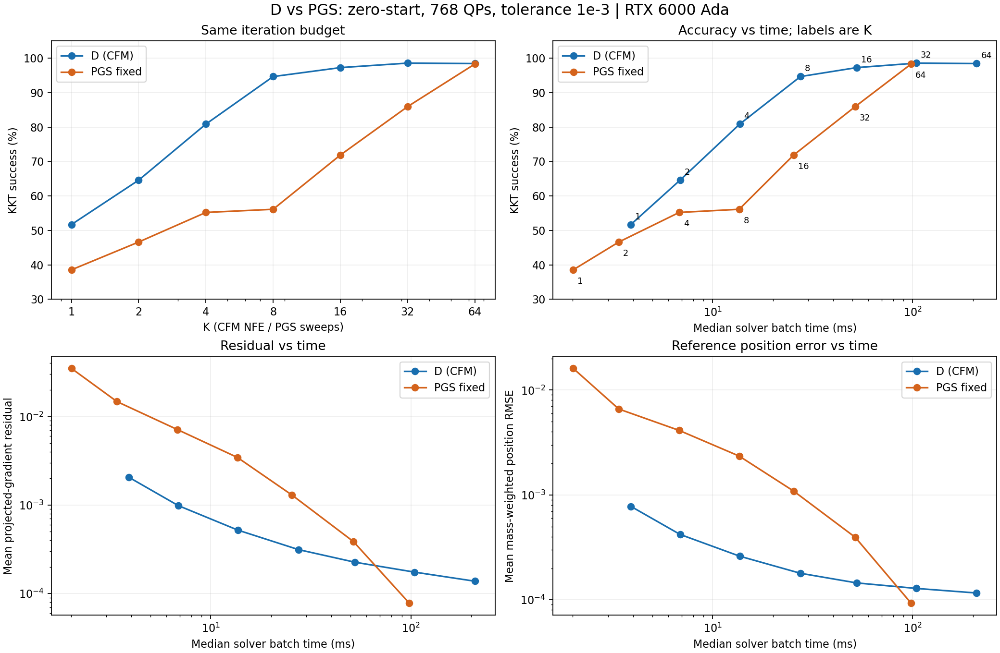

# D와 PGS의 반복 예산별 비교 — 2026-09-17

## 결론

현재 zero-start 실험에서 D는 낮거나 중간 수준의 반복 예산에서 PGS보다 빠르게 오차를 줄인다. 동일 K뿐 아니라 거의 같은 배치 실행 시간에서도 D의 이점이 확인된다. 다만 높은 정확도로 끝까지 수렴시키는 구간에서는 PGS가 따라잡고 평균 오차/시간에서 앞선다. 따라서 이번 결과는 제한된 예산에서의 전역 보정 효과를 지지하며, 전체 PGS 대체나 보편적 가속을 증명하지는 않는다.

## 입력과 검증

- 입력: `C:\Users\alstj\Downloads\eval_test_best_solver_budget.json`; SHA-256 `8c2da7983d7b910770809a9f0c463c35293774ef395691a9bcf0d3b3d5225d8c`.
- Variant D, analytic head, global attention, seed 42; epoch 67/update 26532의 best_solver checkpoint.
- GPU는 NVIDIA RTX 6000 Ada Generation이다. RTX A6000으로 기록된 결과가 아니다.
- 768개 test QP, float32 solver, 원래 float64 기준해, KKT/위치 허용 오차 각각 0.001.
- 모든 raw 실행 완주, CFM NFE=K 및 PGS sweep=K를 개별 QP에서 확인했다. 순서/개수/성공 집계도 검증했다.
- 각 방법 1회 워밍업 후 5회 측정. 아래 시간은 768개 전체 배치의 중앙값이며 단일 QP 지연 시간이 아니다.
- 기준해의 최대 projected-gradient 잔차는 약 9.9983e-8이다.

## 1. 같은 반복 예산: zero-start

| K | D 성공률 | PGS 성공률 | D 평균 잔차 | PGS 평균 잔차 | D 평균 위치 RMSE | PGS 평균 위치 RMSE | D/PGS 시간(ms) |
|---|---|---|---|---|---|---|---|
| 1 | 51.69% | 38.54% | 0.0020516 | 0.0349468 | 0.000778191 | 0.0160809 | 3.90 / 2.01 |
| 2 | 64.58% | 46.61% | 0.000985109 | 0.0147318 | 0.000420321 | 0.00659302 | 6.88 / 3.40 |
| 4 | 80.86% | 55.21% | 0.000520312 | 0.0071164 | 0.00026058 | 0.0041204 | 13.66 / 6.81 |
| 8 | 94.66% | 56.12% | 0.000313308 | 0.00344797 | 0.000179154 | 0.00234648 | 27.46 / 13.58 |
| 16 | 97.27% | 71.88% | 0.000225951 | 0.0012988 | 0.000144998 | 0.00108782 | 52.45 / 25.41 |
| 32 | 98.57% | 85.94% | 0.000174609 | 0.000386645 | 0.000128488 | 0.000394969 | 104.11 / 51.59 |
| 64 | 98.44% | 98.31% | 0.000137882 | 7.78225e-05 | 0.00011621 | 9.29276e-05 | 208.63 / 98.18 |

K=16에서 D는 잔차가 약 5.75배, 위치 RMSE가 약 7.50배 작다. 같은 문제별로 D만 성공한 것은 196건, PGS만 성공한 것은 1건이다. 한 D field 호출은 이 구현에서 PGS 한 sweep의 약 2배 시간이 걸리므로 반복 수만으로 가속을 판단하지 않는다.

## 2. 거의 같은 실행 시간

| D 예산 | PGS 예산 | D/PGS 시간(ms) | D/PGS 성공률 | PGS 대비 D 평균 위치 오차 감소 배수 | D만/PGS만 성공 |
|---|---|---|---|---|---|
| 4 | 8 | 13.66 / 13.58 | 80.86% / 56.12% | 9.00 | 207 / 17 |
| 8 | 16 | 27.46 / 25.41 | 94.66% / 71.88% | 6.07 | 182 / 7 |
| 16 | 32 | 52.45 / 51.59 | 97.27% / 85.94% | 2.72 | 91 / 4 |
| 32 | 64 | 104.11 / 98.18 | 98.57% / 98.31% | 0.72 | 11 / 9 |

시간 예산을 엄밀히 동일하게 맞춘 재실행은 아니고, 기록된 측정 지점 중 가까운 쌍이다. D16/PGS32는 약 1.7% 시간 차이에서 성공률이 11.33%p 차이 난다. D32/PGS64에서는 성공률 차이가 2문제에 불과하고, PGS가 평균 잔차/위치 오차와 시간에서 앞선다. D32의 위치 RMSE p95(0.000555)는 PGS64(0.000793)보다 작아 지표 전체의 일방적 우위는 아니다.

## 3. 학습된 보정의 이점은 stack에서 확인된다

| 장면 | D16 | PGS16 | D32 | PGS32 | D64 | PGS64 |
|---|---|---|---|---|---|---|
| stack | 323/344 | 128/344 | 333/344 | 236/344 | 332/344 | 331/344 |
| floor | 128/128 | 128/128 | 128/128 | 128/128 | 128/128 | 128/128 |
| release | 128/128 | 128/128 | 128/128 | 128/128 | 128/128 | 128/128 |
| free_flight | 168/168 | 168/168 | 168/168 | 168/168 | 168/168 | 168/168 |

K=16의 vertical_stack_n10은 D 30/43, PGS 0/43이다. PGS32도 1/43이므로 D의 이점은 쉬운 floor/free-flight 평균만으로 설명되지 않는다. 다만 이 결과만으로 FM objective, attention, analytic head, inner loss 각각의 기여를 분리할 수는 없다.

## 4. 남은 정확도 병목

- D의 KKT 실패는 K16 21건, K32 11건, K64 12건이다. K32/64의 실패는 모두 vertical stack n8/n10에 집중된다.
- K32→64에서 2문제가 새로 실패하고 1문제가 새로 성공한다. 평균 잔차와 위치 오차는 감소하므로 전체 발산으로 해석하지 않는다.
- K64에서는 D 평균 잔차 1.379e-4, PGS 7.782e-5; D 평균 위치 RMSE 1.162e-4, PGS 9.293e-5다.
- K64의 더 엄격한 잔차 1e-4 진단에서는 D 462/768, PGS 680/768이다. 목표 기준을 바꾸자는 뜻이 아니라 잔여 오차의 성격을 확인한 값이다.
- D K64의 최악 잔차는 약 0.003191로 PGS64의 약 0.002206보다 크다. 동시에 D의 위치 RMSE p95는 더 작으므로 평균/p95/최악값을 구분해야 한다.
- 이 유한한 K 범위로 수렴 오차의 하한이나 이론적 비수렴을 증명할 수 없다. 높은 예산에서 개선이 둔화된 것은 확인된다.

## 5. 기준해 정확도와 KKT 성공률은 다르다

D16의 KKT 성공률은 97.27%, 위치 오차 0.001 이내 비율은 98.18%다. 두 조건을 동시에 만족하는 것은 741/768이다. Tolerance-stopped PGS는 KKT 100%지만 위치 허용 오차 이내는 92.45%(710/768)다. PGS가 다른 답을 만든 버그의 근거는 아니다. KKT 잔차 0.001에서 중단하는 것과 1e-7 수준 기준해에 대한 위치 오차 0.001은 서로 다른 조건이다.

## 6. 초기값이 바뀔 때

| 시작 | D16 / PGS16 KKT 성공률 | D64 / PGS64 KKT 성공률 |
|---|---|---|
| zero | 97.27% / 71.88% | 98.44% / 98.31% |
| over | 81.64% / 68.75% | 96.88% / 97.92% |
| mixed | 69.01% / 77.21% | 79.30% / 99.87% |

Over/mixed는 기준해를 사용해 초기값을 구성한 진단이며 배포 성능의 주 지표가 아니다. Mixed K64에서 D는 위치 정확도 100%지만 KKT 성공률은 79.30%다. Zero-start의 좋은 결과를 임의의 warm start나 복구 능력으로 일반화하면 안 된다.

## 7. 계산 비용과 실행 시간 해석

D16은 배치 신경망 호출 16회, 논리 호출 합계 12,288회, 패딩 포함 token 평가 122,880개, attention score 원소 계산 9,830,400개다. 모델은 108,873 parameters다. PGS16은 유효 접촉 갱신 평균 73.83회/QP다. 이 숫자들은 FLOPs가 아니며 서로 직접 나누지 않는다.

Tolerance-stopped PGS의 평균 sweep은 12.95지만 배치 루프는 가장 늦은 문제 때문에 최대 98 sweep까지 돈다. 완료한 행을 물리적으로 제거하지 않는 현재 dense 배치 구현과 수렴 검사 비용 때문에 중앙값 198.03ms가 걸린다. 따라서 이를 PGS13의 비용으로 해석하거나, D16과 비교해 동일 정확도 3.8배 가속이라고 주장할 수 없다. 고정 예산 PGS와 비교해도 D8~16의 이점은 남는다.

## 다음 실험 우선순위

1. D를 주 기준 모델로 유지하고 K8~16의 오차/시간 이점을 여러 seed와 장면 크기에서 재현한다.
2. Vertical stack n8/n10의 남은 실패를 중심으로 시간별 field/잔차와 마지막 단계의 오차를 진단한다.
3. 현재 inner loss와 checkpoint 선택이 K={1,2,4}에 맞춰져 있다는 불일치를 분리 실험으로 확인한다. K8/16 학습 또는 validation 선택을 검토하되 추가 학습 계산량을 기록하고 test로 checkpoint를 고르지 않는다.
4. 현재 Python/PyTorch 배치 PGS에 대한 결과이며, 최적화된 엔진 PGS나 단일 장면 physical rollout에서의 가속은 별도 검증한다.

이번 분석은 코드·YAML을 변경하지 않았다. 분석 스크립트, 이 보고서, 요약 JSON과 그래프만 추가했다.
