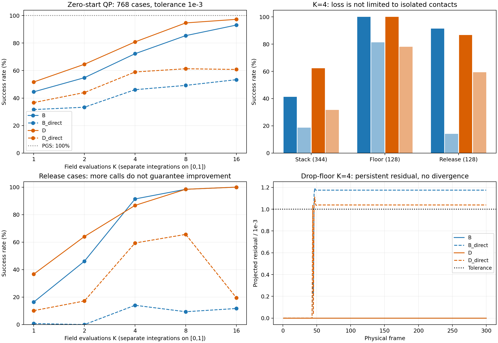

# Direct-head 실험 결과 검토 — 2026-09-16

## 결론

이번 seed 42·동일 예산 비교에서 B_direct/D_direct는 기존 B/D보다 낮은 solver 정확도를 보였다. Direct 출력으로 gradient 경로를 단순화한 변경은 이번 조건에서 성능 개선으로 이어지지 않았다. 해석적 처리를 제거한 영향과 학습·적분 오차의 기여는 추가 진단이 필요하다. 이는 현재 구성의 실험 결론이며 FM의 불가능성이나 direct head의 보편적 열등성을 증명하지 않는다. 기존 analytic 모델을 주 기준으로 유지하는 것이 타당하다.

## 파일 식별 및 공정성

| Variant | 평가 | History | Rollout | 선택 update |
|---|---|---|---|---|
| B | eval_test_best_solver (8).json | history (7).json | direct/rollout.json | 25344 |
| B_direct | eval_test_best_solver (7).json | history (6).json | rollout (8).json | 27720 |
| D | eval_test_best_solver (6).json | history (5).json | rollout (7).json | 26532 |
| D_direct | eval_test_best_solver (5).json | history (4).json | rollout (6).json | 27720 |

B/B_direct, D/D_direct는 head_type·variant·출력 폴더 외의 config가 정확히 동일하다. 모든 모델은 seed 42, batch 512, 30,000 updates, 108,873 parameters. 4개 pairs_summary가 동일하며 train 8,448 QP/202,752 pairs, val/test 각각 768 QP/18,432 pairs다. 모든 기준해는 생성기의 1e-7 검사에 통과했다. History의 best_solver 선택 규칙을 재계산하여 파일 연결을 확인했다. 모든 solver clock과 물리 300프레임이 완료됐지만 완료와 허용 오차 만족은 별개다. 공통 recovery의 시작 상태와 교란이 네 모델에서 동일함도 확인했다. CUDA만 기록되어 GPU 기종은 확인할 수 없다.

## 고정 QP: zero-start 성공률

| 모델 | K=1 | K=2 | K=4 | K=8 | K=16 |
|---|---|---|---|---|---|
| B | 44.53% | 54.82% | 72.27% | 85.42% | 93.10% |
| B_direct | 31.64% | 33.33% | 46.09% | 49.22% | 53.39% |
| D | 51.69% | 64.58% | 80.86% | 94.66% | 97.27% |
| D_direct | 36.72% | 44.01% | 58.98% | 61.33% | 60.81% |

허용 오차 1e-3, 동일 768개 문제. K는 [0,1] 전체를 나누는 CFM 호출 예산이며 K=4 결과에 12번 더 적용해 K=16을 만든 것이 아니다. PGS 기준 실행은 768개 모두 성공했다. PGS는 위 K와 같은 반복 횟수를 부여한 비교가 아니다.

### K=4의 실패 범위

| 모델 | Stack /344 | Floor /128 | Release /128 |
|---|---|---|---|
| B | 142 | 128 | 117 |
| B_direct | 64 | 104 | 18 |
| D | 214 | 128 | 111 |
| D_direct | 109 | 100 | 76 |

D 대비 D_direct의 168건 순감소는 stack 105건, floor 28건, release 35건으로 분해된다. 단일 접촉의 해석적 처리를 잃은 것만으로 전체 저하를 설명할 수 없다. K=16에서는 D가 747/768, D_direct가 467/768이며 D_direct만 성공한 문제는 0개다.

### 호출 수 증가와 release

| 모델 | K=1 | K=2 | K=4 | K=8 | K=16 |
|---|---|---|---|---|---|
| B | 21 | 59 | 117 | 126 | 128 |
| B_direct | 1 | 0 | 18 | 12 | 15 |
| D | 47 | 82 | 111 | 126 | 128 |
| D_direct | 13 | 22 | 76 | 84 | 25 |

D_direct의 release 성공은 K=4의 76/128에서 K=16의 25/128로 감소한다. 많은 호출이 항상 정확도를 높인다는 가정은 성립하지 않는다. 학습한 field의 오차와 시간 분할에 따른 경로 변화가 섞여 있어, 이 로그만으로 원인을 특정할 수는 없다.

## Projection과 복구

| Direct 모델 | K=4 projected 성공 | unclipped 성공 | clip 좌표 누적 | clip step 비율 |
|---|---|---|---|---|
| B_direct | 354 | 307 | 1154 | 23.44% |
| D_direct | 453 | 352 | 2054 | 39.06% |

두 실행은 중간 경로도 달라지므로 차이는 순수한 마지막 clipping 효과가 아니다. Projection을 제거하면 성공 수가 더 낮아지고 음수 multiplier가 남는다. 반대로 D_direct drop_floor K=4는 clipping이 한 번도 없는데 실패하므로, 모든 저하를 clipping 탓으로 돌릴 수 없다.

| 모델 | 공통 상태 독립 교란 성공 /16 | gain 평균 | 공통 상태 상관 교란 성공 /16 | gain 평균 |
|---|---|---|---|---|
| B | 5 | 0.1587 | 4 | 0.2389 |
| B_direct | 2 | 0.2404 | 3 | 0.3762 |
| D | 5 | 0.1522 | 4 | 0.1797 |
| D_direct | 2 | 0.1450 | 3 | 0.2368 |

K=4 전체 시계의 t=0.5에서 교란하고 남은 2회를 적용한 진단이다. Gain은 교란의 추가 영향을 얼마나 줄였는지이며 정답에 얼마나 가까운지를 뜻하지 않는다. D_direct의 독립 교란 gain은 D보다 조금 작지만 성공 수와 절대 잔차는 더 나쁘다. 독립 gain은 16건, 상관 gain은 유효 분모가 있는 13건 평균이다. 자기 trajectory에서의 교란 성공 역시 D 6/16·7/16, D_direct 3/16·4/16으로 개선되지 않았다.

## 물리 rollout: K=4, 각 300프레임

| 장면 | B | B_direct | D | D_direct | PGS |
|---|---|---|---|---|---|
| drop_floor | 0 | 255 | 0 | 256 | 0 |
| oblique_collision | 4 | 258 | 2 | 259 | 0 |
| impact_stack | 35 | 282 | 46 | 285 | 0 |
| collapse_stack | 18 | 286 | 18 | 286 | 0 |

표는 허용 오차를 충족하지 못한 프레임 수다. 각 방법은 자기 궤적에서 서로 다른 QP를 풀기 때문에 고정 QP의 paired 비교와 구분한다.

### 실패 횟수와 발산은 구분해야 한다

D_direct는 drop_floor에서 마지막 100프레임의 잔차가 약 0.001038614로 일정하고 최종 속도는 0이다. B_direct는 약 0.001174670으로 일정하다. 목표 0.001보다 각각 약 3.86%, 17.47% 높다. 따라서 정지 상태의 작은 잔류 오차가 다수의 실패 프레임으로 집계된다. D_direct floor의 실패는 K=1에서 2프레임, K=2에서 255, K=4에서 256이다. 오차 기준을 사후에 완화해 성공으로 바꾸자는 의미가 아니라 실패의 성격을 구분하기 위한 분석이다.

| 장면 | D 최대 기하 침투 | D_direct 최대 기하 침투 | PGS |
|---|---|---|---|
| drop_floor | -0.0000000 | 0.0011115 | -0.0000000 |
| oblique_collision | 0.0010253 | 0.0052336 | 0.0003252 |
| impact_stack | 0.0095736 | 0.0117827 | 0.0009960 |
| collapse_stack | 0.0054041 | 0.0115267 | 0.0009895 |

장면 전체에는 더 큰 과도 오차도 존재한다. 예를 들어 D_direct impact의 최대 기하 침투는 약 0.01178로 PGS의 약 0.000996보다 크다. 모든 raw rollout에서 frozen 후보 바깥의 새 위반은 0이었다. PGS도 swept endpoint-missed event가 있어 전체 연속 충돌의 정확한 ground truth로 취급하지 않는다.

## 시간과 학습

| 모델 | K=4 배치 ms | 성공률 | K=16 배치 ms | 성공률 | 순수 학습 분 |
|---|---|---|---|---|---|
| B | 15.39 | 72.27% | 58.43 | 93.10% | 5.16 |
| B_direct | 14.56 | 46.09% | 55.95 | 53.39% | 4.90 |
| D | 21.76 | 80.86% | 82.76 | 97.27% | 15.38 |
| D_direct | 20.15 | 58.98% | 57.43 | 60.81% | 15.12 |

PGS는 768개 전체를 약 243–244ms에 허용 오차까지 풀었다. 위 CFM 시간은 geometry를 제외한 배치 solver 시간이다. 성공률이 다르므로 PGS 대비 같은 정확도의 가속은 입증되지 않았다. 같은 구조인 B와 D의 시간도 상당히 달라, 작은 head 비용 차이를 이 기록만으로 정밀 추정할 수 없다. 단일 impact 물리 rollout은 D_direct 약 23.76ms/프레임, 같은 파일의 PGS 약 11.01ms/프레임이다. 진단 환경에서 측정된 시간이며 최적화된 native PGS와의 벤치마크는 아니다.

| 모델 | 선택 checkpoint val CFM | 마지막 val CFM | 선택 balanced 성공률 | 마지막 balanced 성공률 |
|---|---|---|---|---|
| B | 0.006340 | 0.007564 | 27.51% | 25.13% |
| B_direct | 0.011564 | 0.018048 | 15.15% | 10.44% |
| D | 0.010241 | 0.006935 | 29.24% | 26.23% |
| D_direct | 0.013658 | 0.013118 | 16.23% | 15.95% |

Balanced validation은 free-flight를 제외하고 source·장면 그룹·K=1/2/4를 평균하므로 test zero 전체 성공률과 분모가 다르다. Direct의 선택 checkpoint CFM loss도 대응 analytic 모델보다 높아, 학습 신호 경로 단순화가 이번 조건에서 더 쉬운 학습으로 이어졌다는 근거가 없다. 모든 모델의 마지막 solver 점수는 선택 checkpoint보다 낮다. 단순히 마지막 checkpoint나 추가 학습을 쓰면 해결된다고 볼 근거도 없다.

## 다음 판단

1. 현재 B/D analytic을 주 기준으로 유지하고 direct 결과는 출력 방식 ablation으로 보존한다.
2. 다음 원인 진단은 단일 접촉·solved/near 상태·release에서 raw field 편향과 FM 시간별 terminal error를 측정하는 것이다. JSON에는 raw field 및 gate gradient가 없어 원인을 확정할 수 없다.
3. 필요하면 이후 별도 비교로 해석적 국소 보정에 학습한 전역 보정을 더하는 구조를 검토할 수 있다. 국소 정확도를 유지하면서 최종 학습 신호를 직접 전달한다는 가설이며, 이번 결과만으로 성공을 보장하지 않는다.
4. 현재는 attention 확대, super token, teacher 제거 또는 recovery 강화의 근거를 제공한 실험이 아니다. 허용 오차는 고정하고 정확도·실제 시간을 함께 비교한다.

학습·평가 소스와 YAML은 수정하지 않았다. 이 검토의 산출물은 보고서, 그림, 요약 JSON 및 분석용 스크립트뿐이다.
