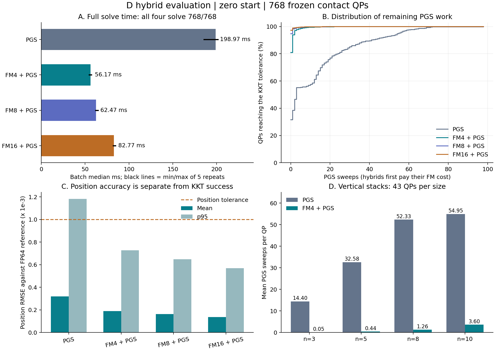

# D 하이브리드 평가 분석 — 2026-09-17

## 결론

현재 frozen contact QP 벤치마크에서 **FM 4회 + PGS가 동일 KKT 허용 오차 1e-3에서 768개를 모두 풀면서 PGS 단독 대비 3.54배 빠르다.** FM 초기 보정 비용과 PGS 마무리 비용을 모두 포함한 결과다. 하이브리드의 이점이 실제 측정으로 확인되었으며, 측정한 K={4,8,16} 중 K=4가 가장 빠르다.

이 수치는 현재 Python/PyTorch dense GPU 배치 solver에 대한 결과다. 전체 물리 엔진, 개별 장면 지연 시간, 최적화된 PGS, 더 큰 접촉계의 가속률은 별도로 검증해야 한다. FM 고유의 기여 역시 같은 backbone의 직접 회귀 등과 비교해야 한다.

## 입력과 검증

- 입력: `C:\Users\alstj\Downloads\eval_test_best_solver_hybrid.json` 및 동명 Markdown 표.
- JSON SHA-256: `58bd10707a11ad26f7a005c9c7f66ed064b88eebd527808b2e5959599c62d43f`.
- D, analytic head, global attention, seed 42, best_solver epoch 67/update 26532. 기존 평가와 같은 체크포인트 메타데이터다.
- NVIDIA RTX 6000 Ada Generation, float32 solver, float64 reference metrics, TF32 비활성화.
- 768개 QP, 최대 접촉 10개, 평균 4.61개. 학습·검증·평가의 크기 목록은 모두 3/5/8/10이다.
- 1회 워밍업 후 5회 반복. 시간은 전체 배치 중앙값이며, geometry/setup·기준해 생성·보고 비용을 제외한다.
- 75개 방법/초기값 조합의 57,600개 저장 행에서 장면 순서, 성공 집계, 작업량, 오차 집계, 시간 중앙값을 확인했다.
- 6,912개 hybrid-prefix 행을 대응 raw FM과 비교했다. 위치 오차는 일치하고 성공 판정도 모두 일치한다. PG 잔차는 배치 계산과 장면별 재계산의 float32 차이가 최대 8.52e-8로 나타난다. 평가 코드가 두 방식으로 잔차를 계산하는 점을 확인했다.
- 모든 하이브리드에서 FM 완주 실패 0, PGS 반복 상한 도달 실패 0이다. 이 검증은 저장 데이터의 일관성 확인이며, 별도 solver 재실행은 아니다.

## 1. 주 결과: zero-start

| 방법 | FM 후 성공 | 최종 KKT 성공 | PGS 평균 / p95 / 최대 sweep | 전체 시간 | PGS 대비 가속 |
|---|---:|---:|---:|---:|---:|
| PGS | — | 768/768 | 12.95 / 55 / 98 | 198.97 ms | 1.00x |
| FM4 + PGS | 621/768 | 768/768 | 0.400 / 2 / 22 | 56.17 ms | 3.54x |
| FM8 + PGS | 727/768 | 768/768 | 0.137 / 1 / 18 | 62.47 ms | 3.18x |
| FM16 + PGS | 747/768 | 768/768 | 0.085 / 0 / 16 | 82.77 ms | 2.40x |

FM4 + PGS는 시간을 약 71.8% 줄였다. 5회 측정 범위는 PGS 185.50–201.59 ms, FM4 + PGS 54.63–57.21 ms로 겹치지 않는다. 이는 해당 실행의 시간 차이를 지지하지만, 독립 학습 seed 반복이나 통계적 신뢰구간을 대신하지 않는다.

FM4가 직접 푼 621개는 추가 PGS sweep이 0이다. 나머지 147개는 평균 2.09 sweep으로 마무리되며, 그중 100개는 1 sweep만 필요하다. 총 논리 PGS sweep 수는 9,946에서 307로 96.9% 감소한다. FM 계산은 별도이므로 이것을 전체 계산량 96.9% 감소로 해석하지 않는다.

문제별로 비교해도 하이브리드 K4/8/16 각각 526개에서 PGS sweep이 감소하고, 증가한 문제는 없다. 이 역시 FM 비용을 제외한 PGS 작업량 비교다.

## 2. 어려운 접촉계의 개선

각 행은 43개 장면의 평균 PGS sweep이다. 모든 방법의 최종 KKT 성공률은 100%다.

| 장면 | PGS | FM4 이후 | FM8 이후 | FM16 이후 |
|---|---:|---:|---:|---:|
| vertical n3 | 14.40 | 0.05 | 0.00 | 0.00 |
| vertical n5 | 32.58 | 0.44 | 0.07 | 0.00 |
| vertical n8 | 52.33 | 1.26 | 0.16 | 0.09 |
| vertical n10 | 54.95 | 3.60 | 1.77 | 1.19 |
| oblique n10 | 19.74 | 0.84 | 0.30 | 0.21 |

특히 vertical n10에서는 FM4 단독 성공이 2/43이지만, 이어지는 PGS가 평균 3.60 sweep만으로 모두 마무리한다. 따라서 **FM 단독 성공률만으로 하이브리드 초기값의 유용성을 판단하면 안 된다.** 이 결과는 FM이 최종 허용 오차까지 직접 도달하지 못해도 후속 PGS에 유용한 상태를 만들었다는 관측이다. 어떤 오차 성분을 제거했는지는 별도 분석이 필요하다.

전체 stack 344개에서 평균 PGS sweep은 27.82에서 0.843으로, 평균 위치 RMSE는 6.92e-4에서 3.74e-4로 감소한다. 개선은 쉬운 free-flight/floor 장면에만 의존하지 않는다.

## 3. 왜 K=4가 가장 빠른가

| 설정 | FM 단계 | PGS 단계 | 연속 측정 전체 |
|---|---:|---:|---:|
| K4 | 13.30 ms | 42.16 ms | 56.17 ms |
| K8 | 26.25 ms | 36.72 ms | 62.47 ms |
| K16 | 50.86 ms | 31.69 ms | 82.77 ms |

단계별 시간은 별도의 동기화 재실행에서 측정했다. 그 합이 전체 시간과 정확히 같을 필요는 없다.

K4→K8에서는 FM 비용이 약 13 ms 늘지만 PGS 단계는 약 5.4 ms만 줄어든다. K8→K16도 추가 FM 비용이 PGS 절감보다 크다. 현재 데이터에서는 더 긴 FM 적분보다 이른 PGS 전환이 유리하다.

다만 K1/K2 하이브리드는 이번 평가에 없으므로 K4를 전역 최적 설정이라고 부를 수는 없다. K1/2/4/8을 validation에서 비교하고, 선택된 규칙을 별도 test에 적용해야 한다. 각 K는 [0,1] 전체 FM 적분 횟수이며, K16 궤적의 앞 4회와 K4는 다르다.

### 배치에서 마지막까지 남는 문제

PGS는 완료된 행을 배열에서 제거하지 않고 업데이트만 0으로 만든다. 따라서 평균 sweep보다 가장 오래 걸리는 문제의 sweep이 배치 시간에 크게 영향을 준다.

- PGS 단독: 평균 12.95이지만 실제 배치 반복은 최대 98 sweep.
- FM4 + PGS: 평균 0.400이지만 실제 배치 반복은 최대 22 sweep.
- 패딩을 포함한 PGS 좌표 방문 수: 752,640 → 168,960.
- K4/8/16에서 최장 PGS 마무리 장면은 모두 `vertical_stack_n10_78`이며 22/18/16 sweep이다.

이는 측정된 가속을 무효로 만들지 않는다. 동일 구현에서 얻은 유효한 개선이다. 다만 완료 행 제거, 크기별 묶음, 최적화된 PGS 구현을 적용하면 절대 시간과 상대 가속률 모두 달라질 수 있다. 최적화는 baseline과 hybrid finish에 동일하게 적용해 비교해야 한다.

## 4. KKT 성공과 기준해 대비 정확도

| 방법 | 평균 위치 RMSE | p95 위치 RMSE | 위치 오차 1e-3 이내 |
|---|---:|---:|---:|
| PGS | 3.1845e-4 | 1.1817e-3 | 710/768 (92.45%) |
| FM4 + PGS | 1.8885e-4 | 7.2691e-4 | 759/768 (98.83%) |
| FM8 + PGS | 1.6326e-4 | 6.4826e-4 | 758/768 (98.70%) |
| FM16 + PGS | 1.3699e-4 | 5.6890e-4 | 760/768 (98.96%) |

FM4 + PGS의 평균 위치 오차는 PGS보다 약 40.7% 작다. 그러나 모든 방법이 KKT 100%라고 해서 기준해 대비 위치 정확도까지 100%인 것은 아니다. 종료 기준이 KKT 1e-3이고 기준해는 약 1e-7까지 푼 해이기 때문이다.

FM4 + PGS의 위치 기준 미달 9개는 vertical n10의 8개와 vertical n5의 1개다. 상세 장면 목록은 `summary.json`에 저장했다.

모든 개별 문제의 위치 오차가 개선되는 것도 아니다. K4는 PGS보다 작은 경우 351개, 큰 경우 150개, 동일한 경우 267개다. 특히 release 그룹에서 PGS의 평균 위치 오차는 3.89e-9, 하이브리드 K4는 1.28e-4다. 두 방법 모두 그 그룹의 허용 오차는 만족하지만, 평균 개선을 모든 장면의 우월성으로 해석하면 안 된다.

## 5. 다른 초기값: 진단 결과

Over/mixed는 기준해를 이용해 초기값을 만든 진단이다. Zero-start와 별도로 해석한다.

| 초기값 | K4 + PGS | K8 + PGS | K16 + PGS | 최종 KKT |
|---|---:|---:|---:|---:|
| over | 3.63x | 1.83x | 1.43x | 모두 768/768 |
| mixed | 4.73x | 3.88x | 2.40x | 모두 768/768 |

Mixed K4는 FM 단독 성공률이 44.14%지만, 나머지 429개를 평균 1.53 PGS sweep으로 마무리해 KKT와 위치 기준을 모두 100% 만족한다. 단독 FM의 약점을 수치적 마무리가 보완한 관측이다. 실제 이전 프레임 warm start에 대한 검증은 아니다.

Over에서는 K4/8/16의 최대 잔여 PGS sweep이 18/37/38로 증가한다. FM 호출 수 증가가 후속 solver 비용 감소를 보장하지 않는 사례다. Over K4의 최악 위치 RMSE는 2.86e-3으로 PGS의 1.74e-3보다 크므로 초기값 전반에 대한 정확도 우월성을 주장하지 않는다.

## 6. 연구상 의미와 다음 실험

이번 결과는 기존의 제한된 예산에서의 오차 개선을 넘어, **동일 KKT 허용 오차와 전 문제 성공에서 FM 비용을 포함한 실행 시간 개선**을 보여준다. 하이브리드를 중심 연구 방향으로 검토할 근거가 강해졌다.

우선순위는 다음과 같다.

1. 재훈련 없이 K1/2 하이브리드와 K4/8을 validation에서 비교한다. K4가 이번 test에서 최선이라는 관측을 보편적 최적값으로 고정하지 않는다.
2. 1e-3, 1e-4, 1e-5의 더 엄격한 KKT 허용 오차에서도 두 방법을 다시 종료 조건에 맞춰 실행한다. 기존 1e-3 최종 상태를 다시 분류하는 것만으로 수렴 시간 곡선을 만들 수 없다.
3. 동일 backbone의 직접 회귀 + PGS와 비교해 FM 학습의 기여를 분리한다. 기존 D_direct는 head ablation이므로 이 비교를 대신하지 않는다.
4. 더 큰 미학습 접촉계, 여러 학습 seed, 여러 배치 크기, 실제 temporal warm start를 포함한 rollout으로 확장한다. 초기화/setup 시간을 포함한 측정과 inference peak memory도 추가한다.
5. 동일한 PGS 최적화를 baseline과 hybrid finish에 적용해 가속률이 유지되는지 확인한다.

첨부 결과만으로 3.54배를 전체 엔진 가속이나 모든 초기값/규모의 가속으로 일반화할 수는 없다. 현재 문제 범위와 구현 안에서는 긍정적인 실험 결과다.

이번 작업에서는 이 폴더의 분석 스크립트, 요약 JSON, 그래프, 보고서만 추가했다. solver·학습 코드와 YAML은 변경하지 않았다.
